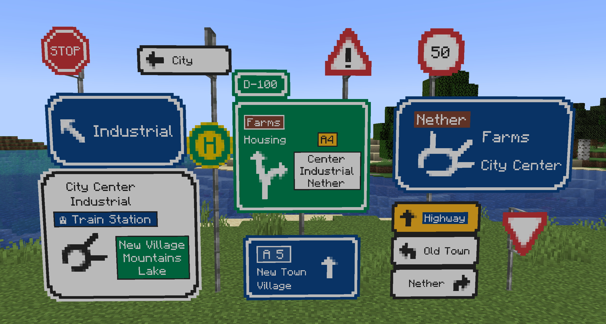
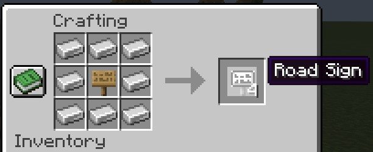
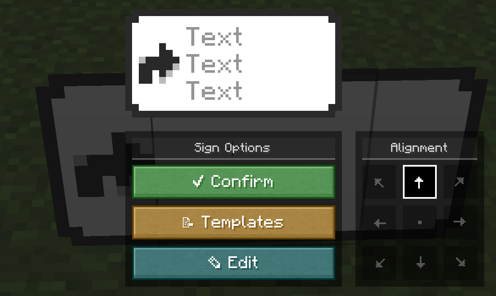
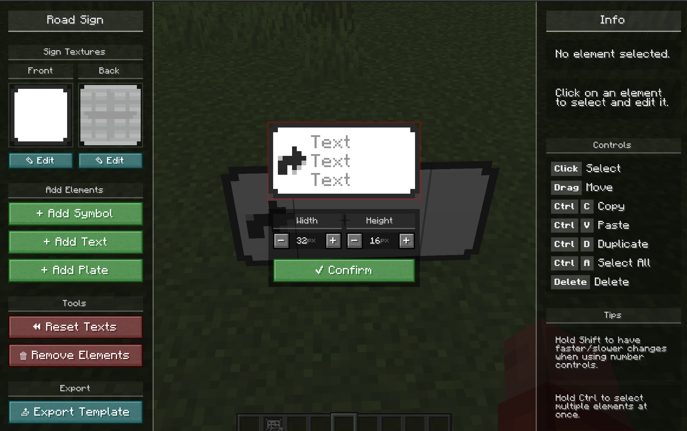

> ClickSigns has been completely rewritten since version 2.0. To access the legacy docs, please click [here](../clicksigns/legacy/index.mdx).

ClickSigns allows you to create infinitely complex road signs as you please! Here's a showcase
of some of the signs you can create with ClickSigns:

---

## Crafting a Road Sign

To craft a road sign, put **8 iron ingots** around **any sign**:

---

## Editing a Road Sign

After crafting a road sign, place it on a wall, on iron bars, or anywhere you'd like,
then click on the road sign to open the **Overview Menu**.

<Callout type="warning">
    Make sure to click **Confirm** once you are done editing the road sign.
    Otherwise, your changes won't be saved!
</Callout>

### Overview Menu

Here, you can load templates, adjust the sign's alignment, quickly
change the text of text elements, and cycle/change the symbols of symbol elements.

### Sign Editor

In order to edit the textures of the road sign, edit, move and add more elements to the sign,
and much more, click on the **Edit** button to open the powerful **Sign Editor**.

