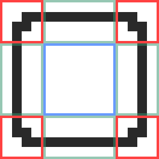

Tilesets are located in the `signs/tilesets` folder of your pack.

### Tileset Image

A tileset image can be any size, but the default textures in ClickSigns are usually
`16 x 16` pixels.

A texture is split into 9 parts, with all the corners being the same size:


> Red corners areas have the dimensions `cornerSize` x `cornerSize`.In this case, `cornerSize` is `4`, so the corners are `4 x 4` pixels.

Corner areas will not be tiled,
and the areas in between the corners, and the center, are tiled to fill
the desired size of the tileset.

### Adding a Tileset

To add a tileset, put your tileset file in the `signs/tilesets` folder.

You then **need** to define a tileset definition for your tileset,
since we need to let ClickSigns know the `cornerSize` of your tileset,
so that it is tiled correctly.

### Tileset Definition

To add a tileset definition, create a json file with the
same name as your texture file, but replace `.png` with `.tileset.json`.

<Files>
    <Folder name="tilesets" defaultOpen>
        <File name="my_tileset.png"/>
        <File name="my_tileset.tileset.json"/>
    </Folder>
</Files>

A tileset definition needs to define a `cornerSize` field,
and can optionally define custom colors:

```json title=".tileset.json"
{
  "cornerSize": 4, // [!code highlight]
  "colors": {
    "foreground": "black",
    "custom_color": "#4287f5"
    // ...
  }
}
```

> You should at least define the `foreground` color, so that default symbols can automatically
adapt to your texture correctly.

> Make sure to check out the [Colors](../colors) page if you haven't already.


## Adding a Category

By default, your texture will not have a category (and show up under "Uncategorized").

To create a new category, all you need is a folder and a `_category.json` file inside
that folder. All tilesets in that folder (but not its subdirectories) will then belong to that category.

<Files>
    <Folder name="tilesets" defaultOpen>
        <Folder name="my_category" defaultOpen>
            <File name="_category.json"/>
            <File name="my_tileset.png"/>
            <File name="my_tileset.static.json"/>
        </Folder>
    </Folder>
</Files>

And then give a name to your category in the `_category.json` file:

```json title="_category.json"
{
  "name": "My Category"
}
```

You can also define a default tileset definition inside of `_category.json`, so that
you don't need to create a `.tileset.json` file for every texture in that category.

```json title="_category.json"
{
  "name": "My Category",
  "default": { // [!code ++]
    "cornerSize": 4, // [!code ++]
    "colors": { // [!code ++]
      "foreground": "black" // [!code ++]
    } // [!code ++]
  } // [!code ++]
}
```

> However, a tileset definition in a `.tileset.json` file will always override the default definition in the category.

### References

#### Tileset Definition (`.tileset.json`)

<TypeTable
    type={{
        cornerSize: {
            type: "Number",
            required: true,
            description: "The size of the corners of the tileset, in pixels."
        },
        colors: {
            type: "Map<String, String>",
            description: "A map of color names to color values."
        }
    }}
/>

#### Category Definition (`_category.json`)

<TypeTable
    type={{
        name: {
            type: "String",
            required: true,
            description: "The name of the category."
        },
        default: {
            type: "Tileset Definition",
            typeDescriptionLink: "#tileset-definition",
            description: "A default tileset definition for all tilesets in this category."
        }
    }}
/>
