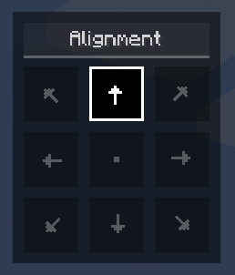
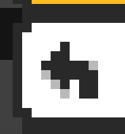
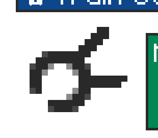
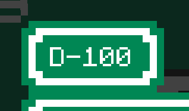

import {Callout} from "fumadocs-ui/components/callout";

A road sign consists of front and back textures, sign elements, and alignment.

## Sign Textures

The front texture of a road sign is its main texture, and will be displayed
on the front of the sign. The front texture determines the size of a sign.

The front texture can be a tileset, or a static image, but more on that
later in the [Textures](textures) section.

The back texture of a road sign will automatically be adjusted to match the shape
and size of the front texture.

> This means that, when creating custom textures with irregular shapes,
> you only have to worry about the front texture.

## Alignment

Before we get to sign elements, let's talk about alignment.

Both road signs, and sign elements have an alignment property.
Alignments determine how a road sign is displayed relative to its position,
and how sign elements are displayed relative to their position on the road sign:

For example, *center top* alignment (the default alignment, as shown on the screen) would mean, that the road sign
will be placed in the center of the road sign, and grow towards the top.

> Road signs will always try to cover the block they are on first, and then align accordingly.

## Sign Elements

Currently, there are 3 types of sign elements: text, symbol, and plate elements.
Each of these elements can be added and positioned anywhere on the road sign,
with an arbitrary alignment.

### Text Elements [step]

Text elements are used to display text on a road sign.

> Text elements support multiple lines of text, where you can align the
text to the left, center, or right.

You have several options to style a text element, including:

- **Text color** – The color of the text itself
- **Background color** – The color of the background behind the text _(optional)_
- **Outline color** – The color of the outline around the text's background _(optional)_
- **Outline width** – The thickness of the outline
- **Padding** – The space between the text and its background/outline
- **Formatting** - Bold, italic, underline, strikethrough _(combinable)_

You can also enable the following formattings bold, italic, underline and strikethrough.

### Symbol Elements [step]

Symbol elements are used to display symbols (icons) on a road sign.

Most arrows, or monochrome symbols will adapt to the background of the road sign
such that they are visible. (e.g. a black arrow on a white sign, but a white arrow on a blue sign)

<Callout type="idea">
    You can also combine symbols to create more complex symbols, such as a round about
    with multiple exits:

    
</Callout>

### Plate Elements [step]

Plate elements are used to attach more sign textures to a sign, these will render a back
texture as well.

It might be useful to think of plate elements as *mini* signs you attach to the sign,
to create more complex signs, such as adding a separate highway number to a bigger sign.

By default, plate elements will match the textures of the main sign, you can however
turn off "Match Sign Textures" in the editor to decouple them.

