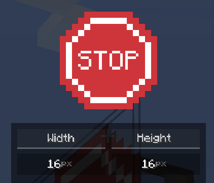
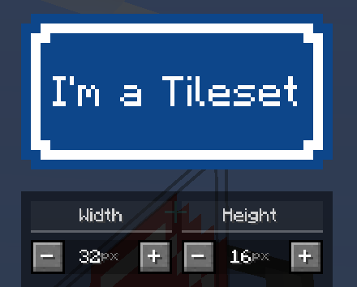
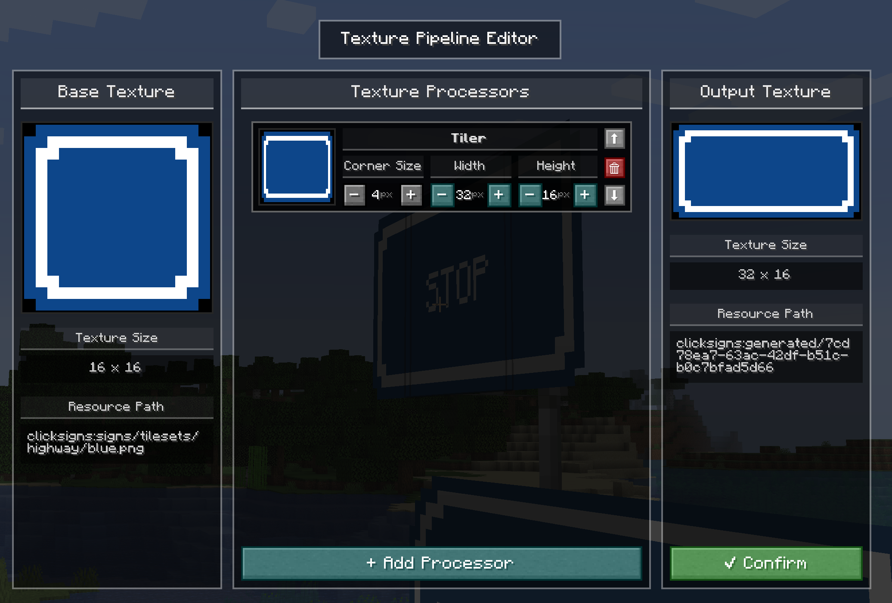
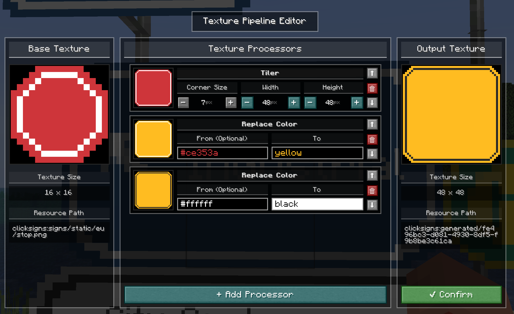
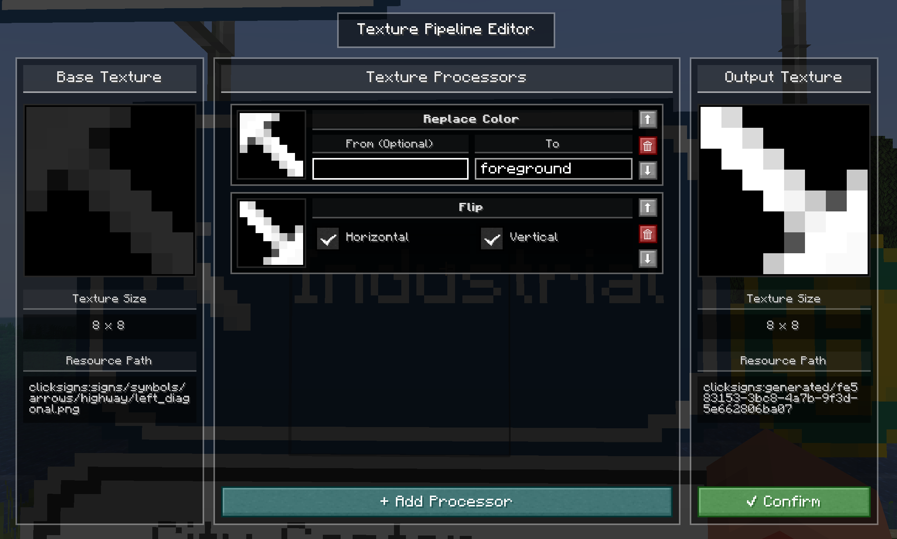

There are two types of textures in ClickSigns: **static textures**, **tilesets**.

### Static Textures

Static textures are regular images that have a set size.
They can be used for more complex signs, but they will only have a single texture.

### Tilesets

Tilesets are textures, that can be **extended to any size**. They offer a simple and easy way
to create a sign of any size, without needing to create a new texture for each size.

> Keep in mind that only static textures and tilesets can be used for the front/back textures of a road sign and
> also for plate elements.Symbol textures are only used for symbol elements.

### Symbol Textures

Symbols behave the same way as static textures, but they offer more flexibility.
Some symbols (such as arrows) will adapt to the background of the road sign,
so that they are always visible. (e.g. a black arrow on a white sign, but a white arrow on a blue sign)

Road signs, symbols, and plate elements all have textures.

As you might have noticed, arrows in ClickSigns will automatically adapt to the background of the road sign,
and that tilesets can be extended to any size. This is internally made possible by the texture pipeline system in ClickSigns.
Thankfully, this system is also made available to you via the editor, so you can create and combine
textures and texture processor to create your own custom textures, without needing a resourcepack!

---

## Texture Pipeline

We have seen that some symbols will change their color to match the background of the road sign,
and tilesets can be tiled to any size.
This is made possible internally by the texture pipeline system in ClickSigns.

Thankfully, you also have access to this powerful system via the editor!
So you can create and combine textures and texture processors to create your own custom textures,
without needing to create a resourcepack!

### Texture Source

Textures in ClickSigns are generated from texture sources. A texture source defines
how a texture is generated and consists of the following components:

- **Base Texture** – The base image _(an asset from a resourcepack, or a default ClickSign asset)_
- **Texture Processors** – A list of texture processors that are applied to the base texture, one after another

A texture source will then be used to generate and cache the final texture, and be displayed
on the road sign, symbol, plate, etc.

### Texture Processors

Currently, there are the following texture processors available:

<Cards>
    <Card title="Tiler">
        Tiles a texture to any `width` and `height`, given a `cornerSize`.
        The corner size defines the size of the corners of the textures, which will not
        be tiled.
    </Card>
    <Card title="Replace Color">
        Replaces a given color in a texture with another color, ignoring the alpha channel.
        If no `from` color is given, it will replace all colors in the texture with the `to` color.
    </Card>
    <Card title="Flip">
        Flips a texture horizontally or vertically.
    </Card>
    <Card title="Rotate">
        Rotates a texture by a given angle in degrees using nearest neighbor interpolation.
    </Card>
</Cards>

### Examples

1. We can tile a normally static texture, and replace a few colors to create a completely new texture:

    

2. We can flip a symbol to create a new symbol:
    > Here we can also see the default "Replace Color" processor in action, that replaces all colors with the foreground color of the sign

    

